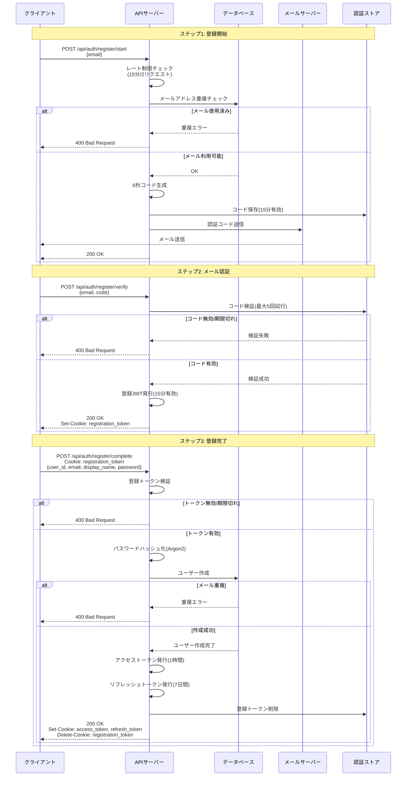
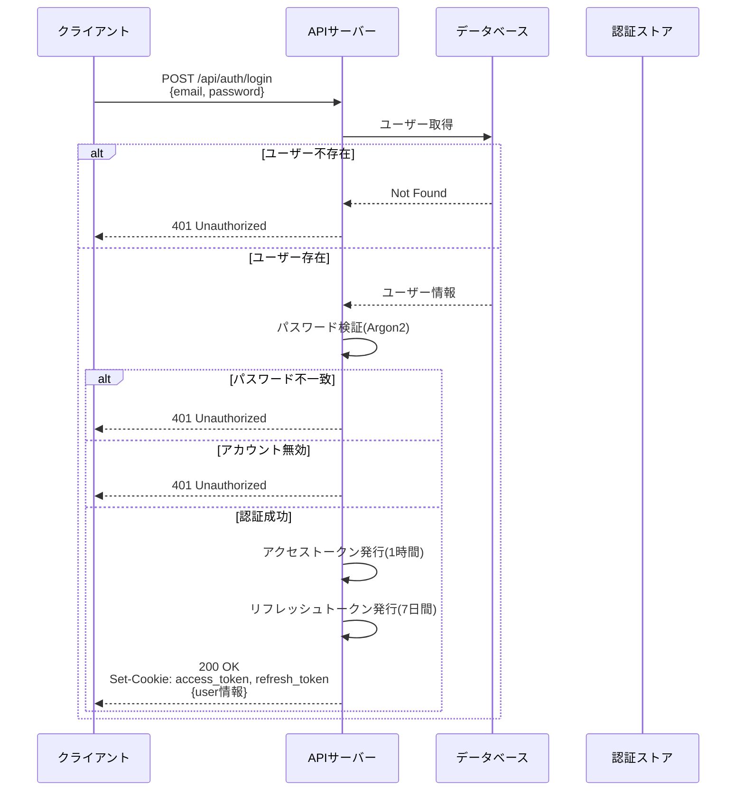
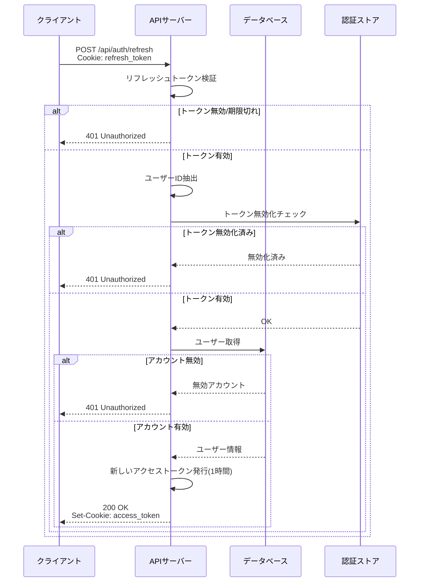
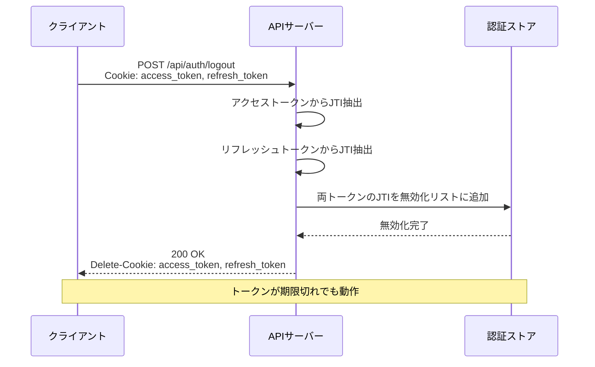
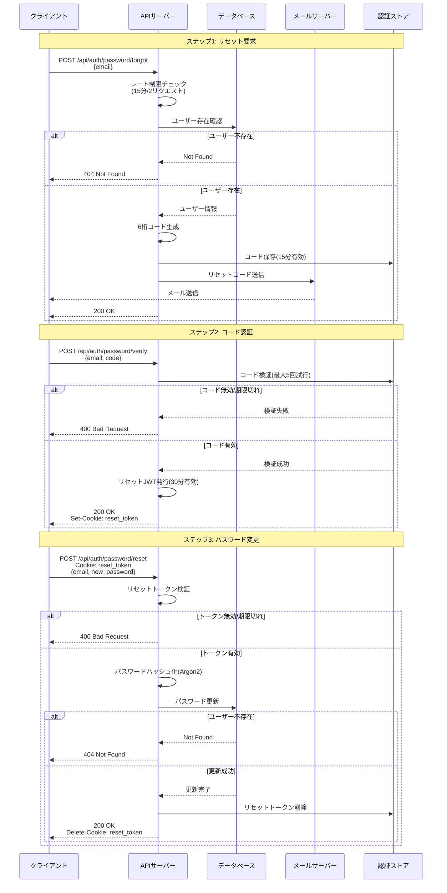
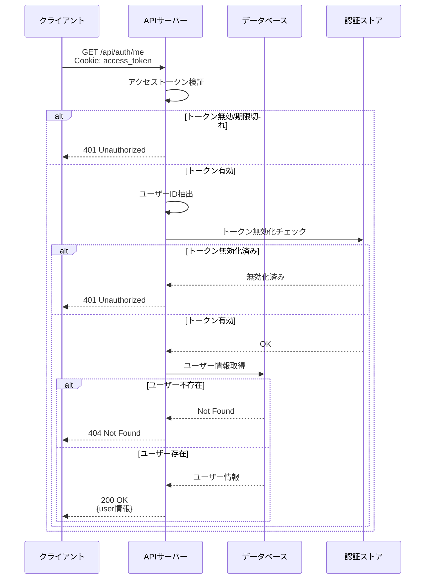
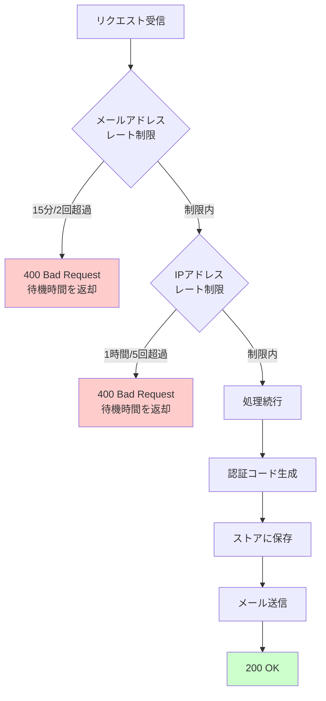

# 認証API ドキュメント

## 概要

このAPIは、メール認証、JWTベースのトークン管理、パスワードリセット機能を備えた安全な認証機能を提供します。

### セキュリティ機能
- 登録時の3ステップメール認証フロー
- パスワードリセット時の3ステップメール認証フロー
- JWTトークン（アクセストークン & リフレッシュトークン）
- HttpOnly Cookieによるトークン保管
- レート制限（15分間にメールアドレスあたり2リクエスト、1時間にIPアドレスあたり5リクエスト）
- Argon2パスワードハッシュ化
- SameSite CookieによるCSRF保護

---

## 認証フロー図

### ユーザー登録フロー（3ステップ）



### ログインフロー



### トークンリフレッシュフロー



### ログアウトフロー



### パスワードリセットフロー（3ステップ）



### 認証済みリクエストフロー



### レート制限フロー



---

## エンドポイント

## エンドポイント

### 1. ユーザー登録フロー（3ステップ）

#### ステップ1: 登録開始
メールアドレスに認証コードを送信します。

**エンドポイント:** `POST /api/auth/register/start`

**リクエストボディ:**
```json
{
  "email": "user@example.com"
}
```

**レスポンス:** `200 OK`
```json
{
  "message": "Verification code sent to email"
}
```

**エラー:**
- `400 Bad Request`: メールアドレスは既に使用されています
- `400 Bad Request`: レート制限超過

---

#### ステップ2: メール認証
メールに送信された6桁のコードを認証します。

**エンドポイント:** `POST /api/auth/register/verify`

**リクエストボディ:**
```json
{
  "email": "user@example.com",
  "code": "123456"
}
```

**レスポンス:** `200 OK`
```json
{
  "message": "Email verified successfully"
}
```

**Set-Cookie:**
- `registration_token` (HttpOnly、15分有効、パス: `/api/auth/register`)

**エラー:**
- `400 Bad Request`: 認証コードが見つかりません
- `400 Bad Request`: 認証コードの有効期限が切れています
- `400 Bad Request`: 試行回数の上限に達しました
- `400 Bad Request`: 認証コードが正しくありません

---

#### ステップ3: 登録完了
Cookieの登録トークンを使用してユーザーアカウントを作成します。

**エンドポイント:** `POST /api/auth/register/complete`

**必要なCookie:**
- `registration_token`

**リクエストボディ:**
```json
{
  "user_id": "unique_user_id",
  "email": "user@example.com",
  "display_name": "山田太郎",
  "password": "secure_password"
}
```

**レスポンス:** `200 OK`
```json
{
  "message": "Registration successful",
  "user": {
    "user_id": "unique_user_id",
    "email": "user@example.com",
    "display_name": "山田太郎"
  }
}
```

**Set-Cookie:**
- `access_token` (HttpOnly、パス: `/api`)
- `refresh_token` (HttpOnly、パス: `/api/auth`)
- `registration_token`を削除

**エラー:**
- `400 Bad Request`: 登録トークンが見つかりません
- `400 Bad Request`: 登録トークンの有効期限が切れています
- `400 Bad Request`: メールアドレスは既に使用されています
- `400 Bad Request`: メールアドレスが一致しません

---

### 2. ログイン

**エンドポイント:** `POST /api/auth/login`

**リクエストボディ:**
```json
{
  "email": "user@example.com",
  "password": "secure_password"
}
```

**レスポンス:** `200 OK`
```json
{
  "message": "Login successful",
  "user": {
    "user_id": "unique_user_id",
    "email": "user@example.com",
    "display_name": "山田太郎"
  }
}
```

**Set-Cookie:**
- `access_token` (HttpOnly、1時間有効、パス: `/api`)
- `refresh_token` (HttpOnly、7日間有効、パス: `/api/auth`)

**エラー:**
- `401 Unauthorized`: ユーザーが見つかりません
- `401 Unauthorized`: パスワードが正しくありません
- `401 Unauthorized`: アカウントは無効化されています

---

### 3. ログアウト

**エンドポイント:** `POST /api/auth/logout`

**必要なCookie:**
- `access_token` (オプション)
- `refresh_token` (オプション)

**レスポンス:** `200 OK`
```json
{
  "message": "Logout successful"
}
```

**Set-Cookie:**
- `access_token`を削除
- `refresh_token`を削除

**注意:**
- トークンからJTIを抽出して無効化リストに追加します
- トークンが期限切れまたは無効でも動作します

---

### 4. 現在のユーザー情報取得

**エンドポイント:** `GET /api/auth/me`

**必要なCookie:**
- `access_token`

**レスポンス:** `200 OK`
```json
{
  "user": {
    "user_id": "unique_user_id",
    "email": "user@example.com",
    "display_name": "山田太郎",
    "is_active": true
  }
}
```

**エラー:**
- `401 Unauthorized`: 認証が必要です
- `401 Unauthorized`: トークンが無効です
- `404 Not Found`: ユーザーが見つかりません

---

### 5. アクセストークンのリフレッシュ

**エンドポイント:** `POST /api/auth/refresh`

**必要なCookie:**
- `refresh_token`

**レスポンス:** `200 OK`
```json
{
  "message": "Token refresh successful"
}
```

**Set-Cookie:**
- `access_token` (新しいトークン、HttpOnly、1時間有効)

**エラー:**
- `401 Unauthorized`: リフレッシュトークンが必要です
- `401 Unauthorized`: トークンが無効または期限切れです
- `401 Unauthorized`: アカウントは無効化されています

---

### 6. パスワードリセットフロー（3ステップ）

#### ステップ1: パスワードリセット要求
メールアドレスに認証コードを送信します。

**エンドポイント:** `POST /api/auth/password/forgot`

**リクエストボディ:**
```json
{
  "email": "user@example.com"
}
```

**レスポンス:** `200 OK`
```json
{
  "message": "Password reset code sent to email"
}
```

**エラー:**
- `404 Not Found`: ユーザーが見つかりません
- `400 Bad Request`: レート制限超過

---

#### ステップ2: リセットコード認証
メールに送信された6桁のコードを認証します。

**エンドポイント:** `POST /api/auth/password/verify`

**リクエストボディ:**
```json
{
  "email": "user@example.com",
  "code": "123456"
}
```

**レスポンス:** `200 OK`
```json
{
  "message": "Code verified successfully"
}
```

**Set-Cookie:**
- `reset_token` (HttpOnly、30分有効、パス: `/api/auth/password`)

**エラー:**
- `400 Bad Request`: 認証コードが見つかりません
- `400 Bad Request`: 認証コードの有効期限が切れています
- `400 Bad Request`: 試行回数の上限に達しました
- `400 Bad Request`: 認証コードが正しくありません

---

#### ステップ3: パスワードリセット完了
Cookieのリセットトークンを使用してパスワードをリセットします。

**エンドポイント:** `POST /api/auth/password/reset`

**必要なCookie:**
- `reset_token`

**リクエストボディ:**
```json
{
  "email": "user@example.com",
  "new_password": "new_secure_password"
}
```

**レスポンス:** `200 OK`
```json
{
  "message": "Password reset successful"
}
```

**Set-Cookie:**
- `reset_token`を削除

**エラー:**
- `400 Bad Request`: リセットトークンが見つかりません
- `400 Bad Request`: リセットトークンの有効期限が切れています
- `400 Bad Request`: メールアドレスが一致しません
- `404 Not Found`: ユーザーが見つかりません

---

### 7. パスワード変更（認証済み）

**エンドポイント:** `POST /api/auth/reset-password`

**必要なCookie:**
- `access_token`

**リクエストボディ:**
```json
{
  "old_password": "current_password",
  "new_password": "new_secure_password"
}
```

**レスポンス:** `200 OK`
```json
{
  "message": "Password reset successful"
}
```

**エラー:**
- `401 Unauthorized`: 認証が必要です
- `401 Unauthorized`: 古いパスワードが正しくありません
- `404 Not Found`: ユーザーが見つかりません

---

## トークン管理

### アクセストークン
- **有効期限:** 1時間
- **保存場所:** HttpOnly Cookie、パス: `/api`
- **用途:** すべての認証済みエンドポイントで必要
- **内容:** ユーザーID、ロール、有効期限

### リフレッシュトークン
- **有効期限:** 7日間
- **保存場所:** HttpOnly Cookie、パス: `/api/auth`
- **用途:** 新しいアクセストークンの取得に使用
- **内容:** ユーザーID、有効期限

### 登録トークン（一時的）
- **有効期限:** 15分
- **保存場所:** HttpOnly Cookie、パス: `/api/auth/register`
- **用途:** 登録完了時の1回限りの使用
- **内容:** メールアドレス、有効期限

### リセットトークン（一時的）
- **有効期限:** 30分
- **保存場所:** HttpOnly Cookie、パス: `/api/auth/password`
- **用途:** パスワードリセット時の1回限りの使用
- **内容:** メールアドレス、有効期限

---

## レート制限

### メールアドレスベースのレート制限
- **制限:** メールアドレスあたり15分間に2リクエスト
- **適用対象:**
  - 登録開始
  - パスワードリセット要求

### IPアドレスベースのレート制限
- **制限:** IPアドレスあたり1時間に5リクエスト
- **適用対象:**
  - 登録開始
  - パスワードリセット要求

### 認証コード試行回数
- **制限:** コードあたり5回まで
- **制限後:** コードが無効化され、新しいコードを要求する必要があります

---

## エラーレスポンス形式

すべてのエラーレスポンスは次の形式に従います:

```json
{
  "error": "何が問題だったかを説明するエラーメッセージ"
}
```

### 一般的なHTTPステータスコード
- `200 OK`: リクエスト成功
- `400 Bad Request`: バリデーションエラーまたは不正な入力
- `401 Unauthorized`: 認証が必要または無効な認証情報
- `404 Not Found`: リソースが見つかりません
- `500 Internal Server Error`: サーバーエラー

---

## 完全なフロー例

### 登録フロー例

```bash
# ステップ1: 登録開始
curl -X POST http://localhost:8000/api/auth/register/start \
  -H "Content-Type: application/json" \
  -d '{"email": "user@example.com"}'

# メールで6桁のコードを確認

# ステップ2: コードでメール認証
curl -X POST http://localhost:8000/api/auth/register/verify \
  -H "Content-Type: application/json" \
  -d '{"email": "user@example.com", "code": "123456"}' \
  -c cookies.txt

# ステップ3: 登録完了
curl -X POST http://localhost:8000/api/auth/register/complete \
  -H "Content-Type: application/json" \
  -b cookies.txt \
  -c cookies.txt \
  -d '{
    "user_id": "myuserid",
    "email": "user@example.com",
    "display_name": "山田太郎",
    "password": "SecurePass123!"
  }'
```

### ログインと保護されたリソースへのアクセス

```bash
# ログイン
curl -X POST http://localhost:8000/api/auth/login \
  -H "Content-Type: application/json" \
  -c cookies.txt \
  -d '{"email": "user@example.com", "password": "SecurePass123!"}'

# 保護されたリソースにアクセス
curl -X GET http://localhost:8000/api/auth/me \
  -b cookies.txt
```

### パスワードリセットフロー例

```bash
# ステップ1: パスワードリセット要求
curl -X POST http://localhost:8000/api/auth/password/forgot \
  -H "Content-Type: application/json" \
  -d '{"email": "user@example.com"}'

# メールで6桁のコードを確認

# ステップ2: リセットコード認証
curl -X POST http://localhost:8000/api/auth/password/verify \
  -H "Content-Type: application/json" \
  -d '{"email": "user@example.com", "code": "654321"}' \
  -c cookies.txt

# ステップ3: パスワードリセット
curl -X POST http://localhost:8000/api/auth/password/reset \
  -H "Content-Type: application/json" \
  -b cookies.txt \
  -d '{
    "email": "user@example.com",
    "new_password": "NewSecurePass456!"
  }'
```

---

## 必要な環境変数

```bash
# JWT秘密鍵
JWT_SECRET=your-secret-key-here

# SMTP設定
SMTP_HOST=smtp.example.com
SMTP_PORT=587
SMTP_USERNAME=your-smtp-username
SMTP_PASSWORD=your-smtp-password
SMTP_FROM_EMAIL=noreply@example.com
SMTP_FROM_NAME=Your App Name
```

---

## ベストプラクティス

1. **本番環境では必ずHTTPSを使用** - Cookieの`secure: true`を設定
2. **JWT_SECRETを安全に保管** - 環境変数を使用、Gitにコミットしない
3. **適切なCORSポリシーを実装** - 本番環境ではオリジンを制限
4. **レート制限を監視** - アプリケーションのニーズに応じて調整
5. **クライアント側で入力を検証** - 不要なAPIコールを削減
6. **トークンの有効期限を適切に処理** - 自動トークンリフレッシュを実装
7. **セキュリティイベントをログに記録** - ログイン失敗試行、レート制限違反を監視

---

## セキュリティに関する考慮事項

- **パスワード要件:** 最小8文字、最大256文字
- **メール認証:** 登録とパスワードリセットに必須
- **トークン無効化:** ログアウト時に即座にトークンを無効化
- **ブルートフォース攻撃対策:** レート制限と試行回数制限
- **CSRF保護:** SameSite Cookie
- **XSS保護:** HttpOnly CookieによりJavaScriptからのアクセスを防止
